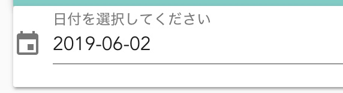

# TaskClear ヘルプ

## TaskClearとは

* タスク管理手法である「タスクシュート」に影響をうけ作成したタスク管理ツールです。
    * [なぜ、仕事が予定どおりに終わらないのか? ~「時間ない病」の特効薬!タスクシュート時間術](https://www.amazon.co.jp/exec/obidos/asin/4774163562/website1-22/)

## 注意点

* 作成者は仕事で使用していますが、完成度としてはベータ版です
* もしかするとデータが消えるバグがあるかもしれません
* TaskClearは一日のタスク実行を推し進める部分に現在注力しており、備忘録(ToDoリスト)や長期的なプロジェクトの管理には適していません
* このツールの安定度の面からも絶対忘れると困る事は別のシステムで管理する事をお勧めします
  * ご参考までに私は以下のツールも併用しています
    * Todoist
    * Microsoft Project
    * Redmine backlog plugin

## セットアップ

* いずれセットアップ方法は記載します
* オープンソースです
* 以下のURLからソースをダウンロードできます
  * https://github.com/a-tak/taskclear
* Firebaseへの登録が必要です
* .env.productionにFirebaseのプロジェクト情報を登録する必要があります
  * Windows環境の場合、 [このイシュー](https://github.com/a-tak/taskclear/issues/28)が役に立つかもしれません

## ログイン

* Googleアカウントでログインします

## メイン画面

### 日付指定

* TaskClearは一日分のタスクを一画面に表示するようになっています。
* 昨日や明日のタスクを見たい場合はここから日付をえらんでください

### 週間見積

* 現在開いている日付から一週間先までのタスク終了予定時刻を表示しています。
* 無理のない計画を立てるために活用してください
* 詳細は[週間見積の計算についての詳細](#週間見積の計算についての詳細)に記載しています

### 実行中タスクへジャンプボタン

* 現在実行中のタスクまでスクロールします

### タスク開始・終了ボタン

* タスクを開始するときに押してください
* タスクが開始されると終了ボタンに変わります
* 終了したタスクのボタンは灰色で表示され、タスク名には取消線が入ります

#### タスク割り込み機能

* 何かタスクが開始状態の時に他のタスクを開始しようとすると、今のタスクを中断して他のタスクを開始できます
* この場合、実行中だったタスク名には「中断」と追記され、新たに残りの見積時間が入ったタスクが自動で作成されます。
* 割り込みの作業が終わったら、自動で作成されたタスクを開始して元の作業の続きを行ってください

### タスク編集

* タスク名をクリックするとタスク情報が編集できます
* タスクに掛かる見積時間はここで入力します
* 予定時間帯にタスクを実行する時間を指定します
  * セクション設定で指定した時間帯がリストで表示されます
  * 直接数値入力も可能です
* 時刻は3桁4桁の数字で入力できます
  * 「930」だと「9:30」、「2500」だと翌日の「1:00」になります
* ソート順はタスクの並び替え機能です
* 若い番号にすると上の方に表示されます(同予定時間帯の場合)
* 「見積開始のタスクにする」は週間見積の計算に使用する最初のタスクにチェックします
  * 「身支度」などの朝起きてから最初に実行するタスクにつけると良いです
  * このチェックが付いたタスクは一日の中で一つだけにしてください
* 「見積の区切りのタスクにする」にチェックしたタスクまでの見積を合計して終了予定時刻が週間見積に表示されます
  * 「帰宅」や「就寝」などの区切りのタスクに使うと良いです
  * 一日の中で複数のタスクにチェックをつけることができます
    * 複数のタスクにチェックを入れた場合、明日以降の終了予定時刻は一つ目のチェックが入ったタスクまでを集計して終了予定時刻が表示されます
* 見積時間の計算の詳細は[週間見積の計算についての詳細](#週間見積の計算についての詳細)

#### タスクの並び順について

* タスクは実行した、または実行するであろう順番で上から下に並びます
* 以下の順番でタスクは表示されます
  * 終了したタスク
  * 実行中のタスク
  * まだ開始していないタスク
* 「まだ開始していないタスク」は「予定時間帯」の順に表示されます
* 「予定時間帯」が同じタスク同士は「ソート順」が若い方が上に表示されます
* 「終了したタスク」は開始時間順に表示されます
* 予定時間帯を指定してタスクを実行する順番通りに並べていて他のタスクの割り込みが無ければ、上から下にタスクを順番に実行していくタスクシュートとして理想的な状態になります

### タスク日付変更

* タスクの日付を変更できます
* 週間見積の時間を見ながらタスクの日付を調整しましょう

### タスク複写機能

* タスクをコピーできます
* コピー元のタスクの残り時間が新たに作成されたタスクの見積時間にセットされます
* 終了済みのタスクの開始ボタンを押す事でもコピーできます
  * この場合新たに作成されたタスクは開始状態になります

### リピート設定

* 繰り返し行うタスクの為に、自動的にタスクを作成する機能です
* 曜日にチェックを入れて何曜日に実行するかを決めましょう
* タスクにかかる時間を「見積時間」にいれましょう
* 実行する時間を「予定時間帯」にいれましょう
* 開始日を指定するといつからリピートをはじめるか指定できます
* リピートを解除するには、曜日のチェックをすべて外します
* 繰り返し行うタスクは積極的にリピート設定して、新しい事をする時間が本当にどれだけあるか把握しておきましょう
* 「見積開始のタスクにする」と「見積の区切りのタスクにする」は[タスク編集](#タスク編集)の説明をご覧ください

#### 注意点

* 現在、リピート機能で作成されたタスクの日付を変更しても、本来実施されるべき曜日にタスクが自動生成(復活)されてしまいます
* 日付変更後に復活したタスクを削除すると、以後は復活しません

### タスク削除

* 登録したタスクを削除します
* 削除時に表示されるポップアップから削除を取り消すことができます(直前の削除のみ)
* Zキーでも取り消しできます

### タスク追加

* タスク(やること)を追加します

### ショートカット

#### 未編集状態

| 機能 | キー |
|------|-----|
|タスク追加|A|
|削除を元に戻す|Z|
|ページトップへ|T|
|次実行予定のタスクへ|D|
|明日のタスクリストへ切り替える|F|
|昨日のタスクリストへ切り替える|R|

#### タスク編集状態

| 機能 | キー |
|------|-----|
|編集確定|Enter|
|編集キャンセル|ESC|

### 週間見積の計算についての詳細

* 週間見積に表示されている終了予定時刻は「見積開始のタスクにする」にチェックしたタスクと「見積の区切りタスクにする」にチェックしたタスクの間に登録してあるタスクの見積時間の合計から計算しています

#### 例1

* 以下の例の場合、見積開始タスクになっているタスクAが9:00から始まり、見積区切りタスクになっているタスクCの一つ前のタスクBまでの見積時間が対象となるため終了予定時刻として9:20が表示されます

|タスク名|見積時間(分)|予定時間帯|見積開始タスク|見積区切りタスク|
|-------|----------|--------|-----------|-------------|
|タスクA |        10|    9:00|✅️         ||
|タスクB |        10|        |           ||
|タスクC |        10|        |           |✅️|

→ 終了予定時刻 : 9:20

#### 例2

* 見積開始タスクの前のタスクは見積時間に影響しないため、以下の例の場合も終了予定時刻は9:20になります

|タスク名|見積時間(分)|予定時間帯|見積開始タスク|見積区切りタスク|
|-------|----------|--------|-----------|-------------|
|タスク0 |        10|    8:00|           ||
|タスクA |        10|    9:00|✅️         ||
|タスクB |        10|        |           ||
|タスクC |        10|        |           |✅️|

→ 終了予定時刻 : 9:20

#### 例3

* 見積開始タスクを登録していない場合はその日の最初のタスクが基点になるので、この場合も終了予定時刻は9:20になります

|タスク名|見積時間(分)|予定時間帯|見積開始タスク|見積区切りタスク|
|-------|----------|--------|-----------|-------------|
|タスクA |        10|    9:00|          ||
|タスクB |        10|        |           ||
|タスクC |        10|        |           |✅️|

→ 終了予定時刻 : 9:20

#### 例4

* 既に現在時刻が見積開始タスク(またはその日の最初のタスク)の予定時間帯を越えている場合は現在時刻が基点となるので、現在が10:00の場合は10:20が表示されます

|タスク名|見積時間(分)|予定時間帯|見積開始タスク|見積区切りタスク|
|-------|----------|--------|-----------|-------------|
|タスクA |        10|    9:00|✅️         ||
|タスクB |        10|        |           ||
|タスクC |        10|        |           |✅️|

→ 終了予定時刻 : 10:20

#### 例5

* 完了しているタスクがある場合は、そのタスクの見積時間は終了予定時刻の計算に含まれません

|タスク名|見積時間(分)|予定時間帯|見積開始タスク|見積区切りタスク|
|-------|----------|--------|-----------|-------------|
|タスクA |        10|    9:00|✅️         ||
|<del>タスクB</del> |        10|        |           ||
|タスクC |        10|        |           |✅️|

→ 終了予定時刻 : 9:10

#### 例6

* 見積区切りタスクが複数設定されている場合、一つの見積区切りタスクが完了すると次の見積区切りタスクまでの時間が計上されます
* 例えば以下の状況で現在時間が19:00の場合は19:10が表示されます
  * 帰宅タスクと就寝タスクを見積区切りタスクとして設定すれば、仕事中は帰宅までの時間、帰ってからは寝るまでの時間を週間見積の終了予定時刻に表示できます

|タスク名|見積時間(分)|予定時間帯|見積開始タスク|見積区切りタスク|
|-------|----------|--------|-----------|-------------|
|<del>タスクA</del> |        10|    9:00|✅️         ||
|<del>タスクB</del> |        10|        |           ||
|<del>タスクC</del> |        10|        |           |✅️|
|タスクD |        10|        |           ||
|タスクE |        10|        |           |✅️|

→ 終了予定時 : 19:10

#### 補足

* 実行中のタスクについては見積時間から経過時間を差し引いた残時間を見積時間として計上しています。
  * 差し引いた結果マイナスになる場合は0分として扱っています
* 現在の所、予定時間帯は考慮せずに単純に見積時間の積み上げで終了予定時刻を表示します
  * 例えば18:00に会議のタスクがあれば本来は終了予定時刻は18:00以降になるはずが、残ったているタスクの見積時間を積み上げた結果が17:30の場合は、終了予定時刻にはそのまま17:30が表示されます

## セクション設定画面

* セクションは一日を時間帯毎に区切ったものです
* 起床、仕事開始など一日をいくつかのセクションに区切りましょう
* 邪魔が入らない早朝セクションには集中が必要なタスク、夕方は疲れてくるのであまり頭を使わないタスクを入れるなどセクションにあったタスクを割り当てましょう
* 右上の三点ドットアイコンからセクション設定画面のメニューを選ぶと設定画面が表示できます
* 右下のプラスボタンで新たなセクションを追加します
* 左の枠はセクション名、右はセクションの開始時間を3桁または4桁の数値で入力します
* ゴミ箱のアイコンを押すとセクションを削除できます
* 上矢印のアイコンを押すと、そのセクションを一日の最初のセクションとして指定できます