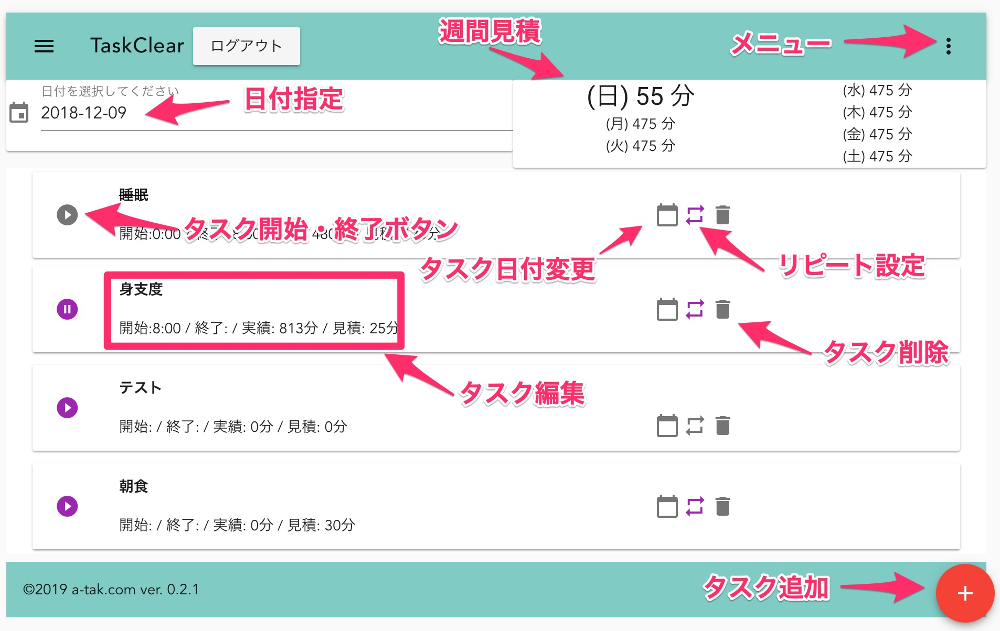
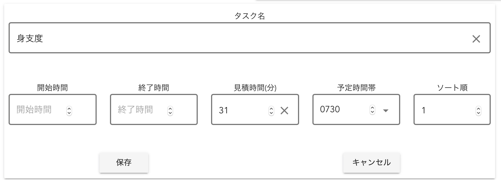
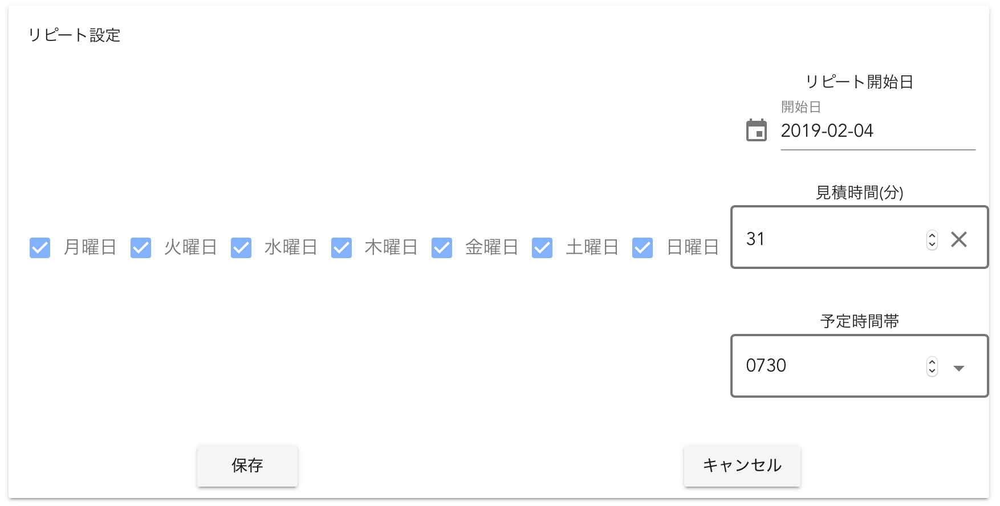
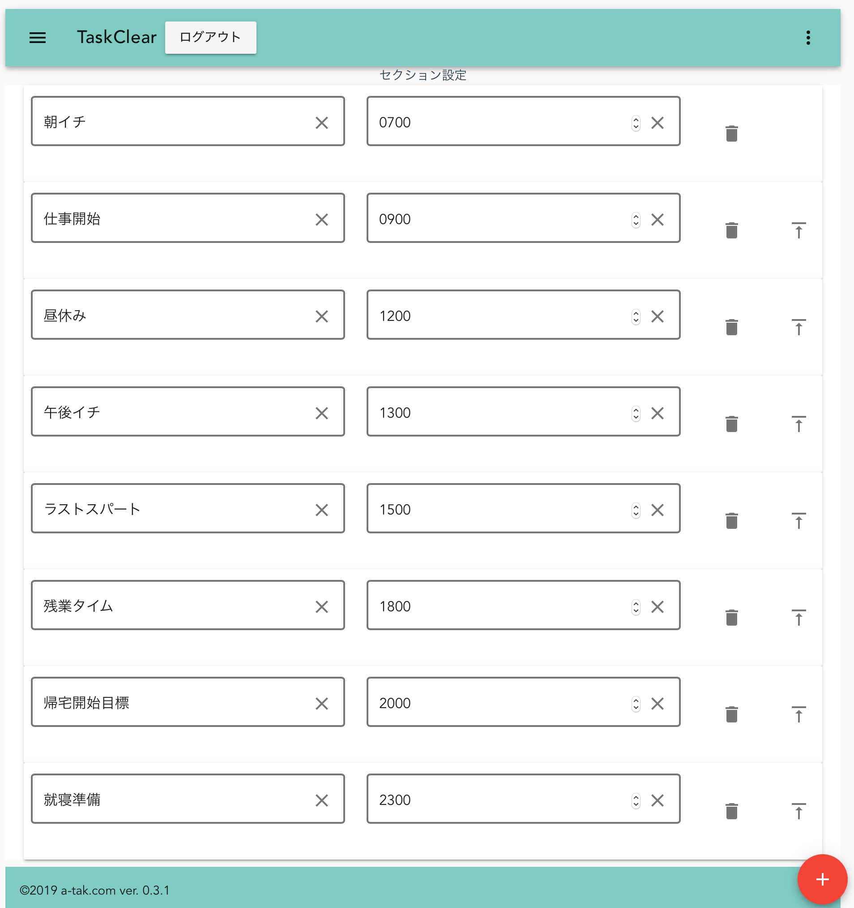

# TaskClear ヘルプ

## TaskClearとは

* タスク管理手法である「タスクシュート」に影響をうけ作成したタスク管理ツールです。
    * [なぜ、仕事が予定どおりに終わらないのか? ~「時間ない病」の特効薬!タスクシュート時間術](https://www.amazon.co.jp/exec/obidos/asin/4774163562/website1-22/)

## 注意点

* 作成者は仕事で使用していますが、完成度としてはベータ版です
* データが消えるバグがあるかもしれませんし、削除を取り消す機能がなかったりします
* TaskClearは一日のタスク実行を推し進める部分に現在注力しており、備忘録(ToDoリスト)や長期的なプロジェクトの管理には適していません
* このツールの安定度の面からも絶対忘れると困る事は別のシステムで管理する事をお勧めします
  * ご参考までに私は以下のツールも併用しています
    * Todoist
    * Microsoft Project
    * Redmine backlog plugin

## セットアップ

* いずれセットアップ方法は記載します
* オープンソースです
* 以下のURLからソースをダウンロードできます
  * https://github.com/a-tak/taskclear
* Firebaseへの登録が必要です
* .env.productionにFirebaseのプロジェクト情報を登録する必要があります
  * Windows環境の場合、 [このイシュー](https://github.com/a-tak/taskclear/issues/28)が役に立つかもしれません

## ログイン

* Googleアカウントでログインします

## メイン画面

### ショートカット

#### 未編集状態

| 機能 | キー |
|------|-----|
|タスク追加|A|
|ページトップへ|T|
|次実行予定のタスクへ|D|
|明日のタスクリストへ切り替える|F|
|昨日のタスクリストへ切り替える|R|

#### タスク編集状態

| 機能 | キー |
|------|-----|
|編集確定|Enter|
|編集キャンセル|ESC|

### 日付指定

* TaskClearは一日分のタスクを一画面に表示するようになっています。
* 昨日や明日のタスクを見たい場合はここから日付をえらんでください

### 週間見積

* 現在開いている日付から一週間先までの見積時間の合計(分)を表示しています。
  * 見づらいので時間表示に変える予定です
* 無理のない計画を立てるために活用してください

### タスク開始・終了ボタン

* タスクを開始するときに押してください
* タスクが開始されると終了ボタンに変わります
* 終了したタスクのボタンは灰色で表示され、タスク名には取消線が入ります

#### タスク割り込み機能

* 何かタスクが開始状態の時に他のタスクを開始しようとすると、今のタスクを中断して他のタスクを開始できます
* この場合、実行中だったタスク名には「中断」と追記され、新たに残りの見積時間が入ったタスクが自動で作成されます。
* 割り込みの作業が終わったら、自動で作成されたタスクを開始して元の作業の続きを行ってください

#### タスク複写機能

* 一旦終了したタスクの開始ボタンを押す事で、新たにタスクを作成して開始する事ができます
* この場合も、残り時間が新たに作成されたタスクの見積時間にセットされます

### タスク編集

* タスク名をクリックするとタスク情報が編集できます
* タスクに掛かる見積時間はここで入力します
* 予定時間帯にタスクを実行する時間を指定します
  * セクション設定で指定した時間帯がリストで表示されます
  * 直接数値入力も可能です
* ソート順はタスクの並び替え機能です
* 若い番号にすると上の方に表示されます

#### タスクの並び順について

* タスクは実行した、または実行するであろう順番で上から下に並びます
* 以下の順番でタスクは表示されます
  * 終了したタスク
  * 実行中のタスク
  * まだ開始していないタスク
* 「まだ開始していないタスク」は「予定時間帯」の順に表示されます
* 「予定時間帯」が同じタスク同士は「ソート順」が若い方が上に表示されます
* 「終了したタスク」は開始時間順に表示されます
* 予定時間帯を指定してタスクを実行する順番通りに並べていて他の割り込みが無ければ、上から下にタスクを順番に実行していく理想的な状態になります
* 数値で指定する今のソート順指定は、**非常に面倒**であるため、ドラッグ&ドロップで並び替える機能を開発予定です

### タスク日付変更

* タスクの日付を変更できます
* 週間見積の時間を見ながらタスクの日付を調整しましょう

### リピート設定

* 繰り返し行うタスクの為に、自動的にタスクを作成する機能です
* 曜日にチェックを入れて何曜日に実行するかを決めましょう
* タスクにかかる時間を「見積時間」にいれましょう
* 実行する時間を「予定時間帯」にいれましょう
* 開始日を指定するといつからリピートをはじめるか指定できます
* リピートを解除するには、曜日のチェックをすべて外します
* 繰り返し行うタスクは積極的にリピート設定して、新しい事をする時間が本当にどれだけあるか把握しておきましょう

#### 注意点

* 現在、リピートタスクの日付を変更しても、本来実施されるべき曜日にタスクが自動生成(復活)されてしまいます
* 日付変更後に復活したタスクを削除すると、以後は復活しません

### タスク削除

* 登録したタスクを削除します

#### 注意点

* 現段階では「やり直し機能」は無いためタスクを削除すると元に戻す事が出来ません
* 改善する予定ですが、こういう意味では本当に忘れてはいけない大事なタスクは別の仕組みで管理しておいた方がいいでしょう

### タスク追加

* タスク(やること)を追加します

## セクション設定画面

* セクションは一日を時間帯毎に区切ったものです
* 起床、仕事開始など一日をいくつかのセクションに区切りましょう
* 邪魔が入らない早朝セクションには集中が必要なタスク、夕方は疲れてくるのであまり頭を使わないタスクを入れるなどセクションにあったタスクを割り当てましょう
* 右上の三点ドットアイコンからセクション設定画面のメニューを選ぶと設定画面が表示できます
* 右下のプラスボタンで新たなセクションを追加します
* 左の枠はセクション名、右はセクションの開始時間を3桁または4桁の数値で入力します
* ゴミ箱のアイコンを押すとセクションを削除できます
* 上矢印のアイコンを押すと、そのセクションを一日の最初のセクションとして指定できます